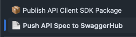
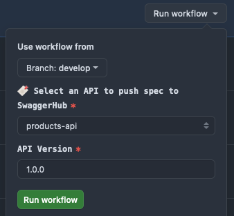
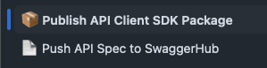
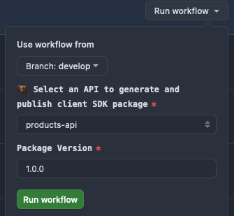

# api-client-sdk-streamline-sample

```bash
API Dev  →  OpenAPI Specs  →  SDK Package  →  API Client Configuration  →  API Client Usage
```

A project demonstrating streamlined API client SDK development workflow - from OpenAPI spec generation, to client SDK publishing, configuration, and consumption:) 
                         
## 🚂 Project Structure

> This project uses a monorepo ([Turborepo](https://turbo.build/repo)) for demonstration purpose.

```
root (turbo monorepo)
├── apps/
│   ├── products-api/                 # Product API service (NestJS)
│   ├── users-api/                    # User API service (NestJS)
│   └── ecom-app/                     # Demo web app (Next.js)
│       ├── app/
│       │   └── api/
│       │       ├── products/
│       │       │   └── route.ts      # Products API route
│       │       └── users/
│       │           └── route.ts      # Users API route
│       └── lib/
│           └── api-client-config/    # SDK configuration
│
├── packages/
│   └── openapi-fetch-runtime/        # Shared runtime utilities
│
├── .changeset/                       # Changesets for versioning
│   └── config.json                   # Changesets configuration
│
├── .github/
│   └── workflows/
│       ├── push-spec.yml             # Pushes OpenAPI specs to SwaggerHub
│       ├── publish-sdk.yml           # Generates & Releases & publishes API Client SDKs
│       ├── version-release.yml       # Handles versioning with changesets
│       └── release-base.yml          # Reusable release workflow
│           
├── package.json
└── turbo.json                        # Turborepo config
```

## 👀 A Closer Look

### 1. 🏗️ API Development

Two NestJS services that auto-generate OpenAPI specs using Swagger decorators:

<details>
<summary>API Services Overview</summary>

```bash
apps/
├── products-api/  # Product service (port: 3001)
│   └── endpoints:
│       POST   /products             → createProduct
│       GET    /products             → getAllProducts
│       GET    /products?category=   → getProductsByCategory
│       GET    /products/:id         → getProduct
└── users-api/     # User service (port: 3002)
    └── endpoints:
        POST   /users                → createUser
        GET    /users                → getAllUsers
        GET    /users/:id            → getUser
```

</details>

> NestJS + Swagger decorators automatically generate clean OpenAPI specs, which we'll use later for SDK generation. The `operationId` in decorators maps directly to SDK method names.

<details>
<summary>Test Endpoints</summary>

```bash
# 1. Start the Service
cd apps/products-api     # or cd apps/users-api
npm run dev              # products: 3001, users: 3002

# 2. View API Documentation
# Products API: http://localhost:3001/api-docs
# Users API:    http://localhost:3002/api-docs

# 3. Test All Endpoints: Run Test Script with Sample Data
npm run demo             # Executes try-{service}-api.sh
# products-api → try-products-api.sh
# users-api   → try-users-api.sh
```

</details>

### 2. 🏒 Push Specs to SwaggerHub 

First, APIs are versioned and released with [Changesets](https://github.com/changesets/changesets):

<details>
<summary>Version management</summary>

```bash
# Version management
.github/workflows/
├── version-release.yml   # Handles changesets & version bumps
└── release-base.yml      # Base release workflow template
```

</details>

Then, OpenAPI specs are generated and pushed to SwaggerHub:

> 👻 While this demo uses a centralized workflow for simplicity, each API could have its own independent versioning and publishing process in a microservices setup.

```bash
.github/workflows/
└── push-spec.yml         # Handles spec versioning & publishing
```




Once published, specs are available on SwaggerHub:
- 📄 [@api-client-sdk-streamline-sample | Products API](https://app.swaggerhub.com/apis/junjie.wu/sample-products-api)
- 📄 [@api-client-sdk-streamline-sample | Users API](https://app.swaggerhub.com/apis/junjie.wu/sample-users-api)

### 3. 🎩 Generate & Publish SDK as NPM packages

Based on these [OpenAPI](https://swagger.io/specification/) specs, TypeScript SDKs can be automatically generated (with [`@openapitools/openapi-generator-cli`](https://github.com/OpenAPITools/openapi-generator-cli)) and published as NPM packages.

> 👻 Instead of keeping generated SDKs in the repo, we generate and publish them on-the-fly directly to NPM.

```bash
.github/workflows/
└── publish-sdk.yml          # Generates & Releases & Publishes SDKs

packages/
└── openapi-fetch-runtime/   # Shared runtime utilities to minimize bundle size
```




Published SDK packages:
- 🧳 [@api-client-sdk-streamline-sample/products-api-client](https://www.npmjs.com/package/@api-client-sdk-streamline-sample/products-api-client)
- 🧳 [@api-client-sdk-streamline-sample/users-api-client](https://www.npmjs.com/package/@api-client-sdk-streamline-sample/users-api-client)

<details>
<summary>SDK Generation Process: A Summary</summary>

```bash
1. Pull OpenAPI specs from SwaggerHub
2. Generate TypeScript clients using `openapi-generator-cli`
3. Configure shared runtime package to avoid duplication
4. Update package metadata and documentation
5. Create GitHub release
6. Publish to NPM
```

</details>

### 4. 🏗️ API Client Configuration

Now that we have our SDKs published on NPM, let's set up API client configuration in our Next.js app:

```bash
apps/ecom-app/
├── app/
│   └── api/                    # API Routes
│       ├── products/route.ts   # Products endpoints
│       └── users/route.ts      # Users endpoints
└── lib/
    └── api-client-config/      # Shared client configuration
```

Client Configuration Structure:

```bash
api-client-config/
├── configs/            # Environment-based configuration
├── middleware/         # Request & Response & onError middlewares
├── errors/             # Error handling & types
├── cache.ts            # Client instance caching
├── config.ts           # Base client configuration
├── factory.ts          # Factory pattern for client creation
└── logger.ts           # Logging utilities
```

### 5. 🎸 Example usage in Next.js API routes:

```typescript
import { getProductsApi } from '@/lib/api-client-config'

export async function GET() {
  const productsApi = getProductsApi()  // Pre-configured client
  
  // Clean method names thanks to Swagger decorators:)
  const products = await productsApi.getAllProducts()
  
  return NextResponse.json(products)
}
```

## 🧪 Try It Out

Test the complete workflow:

<details>
<summary>1. Start API services and Run the Next.js app</summary>

```bash
# Using Turbo (recommended):
npm run dev
```

This starts:
- Next.js app on `http://localhost:3000`
- Products API on `http://localhost:3001`
- Users API on `http://localhost:3002`

Or start services individually:

```bash
# Start Products API
cd apps/products-api
npm run dev

# Start Users API
cd apps/users-api
npm run dev

# Start Next.js App
cd apps/ecom-app
npm run dev
```

</details>

<details>
<summary>2. Test Endpoints</summary>

#### Products API

```bash
# Create a product
curl -X POST http://localhost:3000/api/products \
  -H "Content-Type: application/json" \
  -d '{
    "name": "Mechanical Keyboard",
    "price": 159.99,
    "description": "Premium mechanical keyboard with RGB lighting",
    "categories": ["electronics", "accessories"]
  }'

# Get all products
curl http://localhost:3000/api/products

# Get products by category
curl http://localhost:3000/api/products?category=electronics

# Get a specific product
curl http://localhost:3000/api/products/1
```

#### Users API

```bash
# Create a user
curl -X POST http://localhost:3000/api/users \
  -H "Content-Type: application/json" \
  -d '{
    "name": "Jane Smith",
    "email": "jane@example.com",
    "phone": "111-111-1111"
  }'

# Get all users
curl http://localhost:3000/api/users

# Get a specific user
curl http://localhost:3000/api/users/1
```

</details>

<details>

<summary>🪐 How It Works: A Short Review</summary>

```
1. The request hits the Next.js proxy routes
2. Routes use the generated SDK clients
3. Clients make requests to local API services
4. Services process and return the data
5. Data flows back through the SDK to the application
```

</details>

## 👻 Links

OpenAPI Specs on SwaggerHub:
- 📄 [@api-client-sdk-streamline-sample | Products API](https://app.swaggerhub.com/apis/junjie.wu/sample-products-api)
- 📄 [@api-client-sdk-streamline-sample | Users API](https://app.swaggerhub.com/apis/junjie.wu/sample-users-api)

API Client SDK Packages on NPM:
- 🧳 [@api-client-sdk-streamline-sample/products-api-client](https://www.npmjs.com/package/@api-client-sdk-streamline-sample/products-api-client)
- 🧳 [@api-client-sdk-streamline-sample/users-api-client](https://www.npmjs.com/package/@api-client-sdk-streamline-sample/users-api-client)
